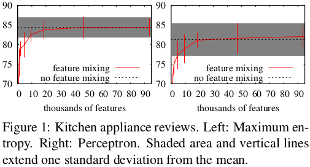

Feature Hashing for Large Scale Multitask Learning
==================================================

Weinberger, Dasgupta, Langford, Smola, Attenberg (ICML 2009)

Presented at ILPS Reading Group by: Lars Buitinck

----

Machine learning with symbolic features
---------------------------------------

* Learning algorithms formulated on vectors/matrices:
  :math:`w \cdot x > 0`
* NLP/IR applications: text
* Features are initially strings
* Need to **vectorize**: "buy v1agra now!" → (0, 0, 1, 0, 1, 1, 0, 1)

----

Vectorizing
-----------

* Naive way, step 1: learn a dictionary

.. sourcecode:: python

    feature_to_index = {}
    i = 0
    for s in samples:
        for f, v in s:
            if f not in feature_to_index:
                feature_to_index[f] = i
                i += 1

* Step 2: construct (sparse) vectors

.. sourcecode:: python

    for f, v in sample:
        vector[feature_to_index[f]] = v

----

Problems
--------

* Dictionary size = vocabulary size
* In true online settings, feature set keeps growing
* Sometimes intentionally:
  when spam filter has learned high weight for "v1agra",
  spammers invent new misspellings, exploit Unicode, etc.
* Specialized string tables (tries, automata) help, but still linear memory use

----

"Hashing trick" 0.9
-------------------

* Idea: hash the strings into the indices directly: O(1) memory
* The column index of a feature ``f`` is ``h(f) mod n``
* In case of collision, add values (or OR them)
* Ganchev and Dredze (2008) showed this to work well (picture),
  but collisions increase with decreasing ``n``

----

Second hash function
--------------------

* For very large problems, collisions matter, so solve that
* Let ``ξ`` be a hash function with range {-1, 1}
* Feature to set is still ``h(f) mod n``,
  but multiply its value by ``ξ(f)``:

.. sourcecode:: python

    for f, v in sample:
        vector[h(f) % n] += ξ(f) * v

----

Second hash function's purpose
------------------------------

* Suppose we're dealing with boolean features
* Collision between f1 and f2, both true

========= ========= =================
``ξ(f1)`` ``ξ(f2)`` ``ξ(f1) + ξ(f2)``
========= ========= =================
-1        -1        -2
-1         1         0
 1        -1         0
 1         1         2
========= ========= =================

* 50% chance of resolving the collision!

----

It gets better
--------------

* Expected value in each column is zero, so data is *centered* for free
* With boolean input, Gaussian-like output
* This is what many other learning algorithms want
* Works like a kernel :math:`K(x,x') = \phi(x) \cdot \phi(x')`
  with :math:`\mathbb{E}[\phi(x) \cdot \phi(x')] = x \cdot x'`
  (expectation over the hash function :math:`\phi`)
* Can store weight vectors of classifier as a sparse table

----

Multitask learning
------------------

* Global spam filter + personalized filter
* Massively multiclass classification
* L2R (?): per query-term ranking

----

Hashing for multitask learning
------------------------------

* Hash not ``f``, but ``(T, f)`` for task ``T``
* So ``(qf, df)`` for all query (document) features ``qf`` (``df``)
* Or ``(user_id, term)`` for personalized spam filter
* Single parameter vector for all tasks
  to achieve :math:`f(x) = w \cdot (\phi(x) + \phi(x, T))`
* (Can similarly hash pairs of :math:`x` to get quadratic kernel)

----

That's it for now
-----------------

* Weinberger, Dasgupta, Langford, Smola and Attenberg (2009).
  `Feature Hashing for Large Scale Multitask Learning
  <http://alex.smola.org/papers/2009/Weinbergeretal09.pdf>`_. ICML.
* Ganchev and Dredze (2008).
  `Small statistical models by random feature mixing
  <http://www.cs.jhu.edu/~mdredze/publications/mobile_nlp_feature_mixing.pdf>`_.
  ACL HLT Workshop on Mobile Language Processing.

* Questions?
